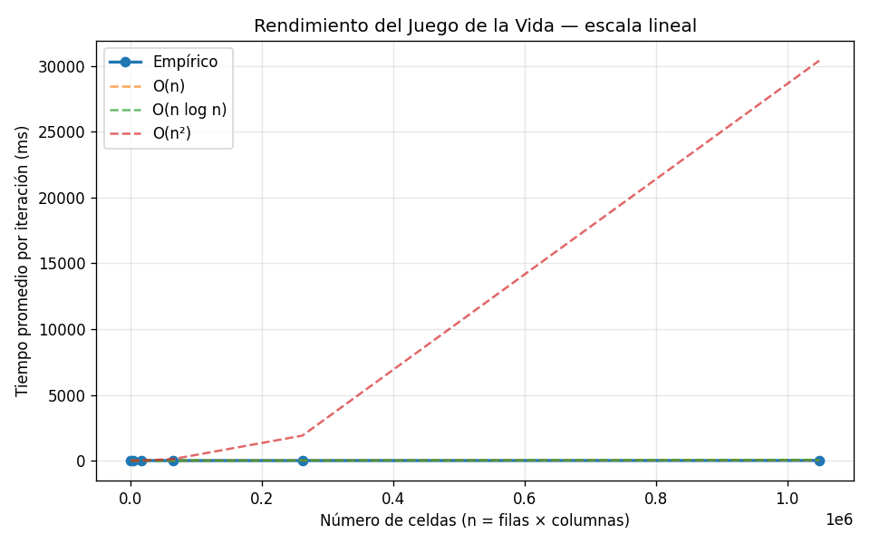
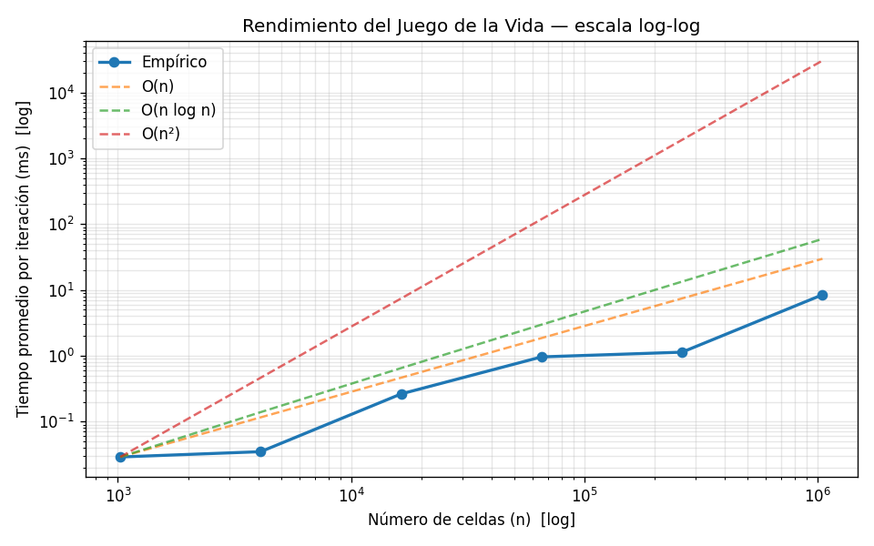

# Tarea 1 — Juego de la Vida de Conway

Implementacion en Python del Juego de la Vida de Conway para el curso de
Programacion Paralela y Distribuida (LEAD University).

## Requisitos

- Python 3.9 o superior
- Librerias listadas en `requirements.txt`

## Instalacion

```bash
python -m pip install -r requirements.txt
```

## Como ejecutar

### Demo animada de un patron clasico

```bash
python main.py demo --pattern *tipo de patron* --size *tamaño del encuadre* --steps *numero de pasos*
```

Patrones disponibles: `block`, `beehive`, `blinker`, `toad`, `beacon`,
`pulsar`, `glider`, `lwss`, `random`.

### Guardar la animacion como GIF

```bash
python main.py demo --pattern pulsar --size 32 --steps 60 --save salida.gif --no-show
```

### Benchmark de rendimiento

```bash
python main.py benchmark --sizes 32 64 128 256 512 1024 --reps 50
```

Comparar paralelo vs secuencial:

```bash
python main.py benchmark --sizes 64 128 256 512 1024 --reps 50 --compare
```

Los resultados (graficas).

## Resultados

### Ejemplos de animaciones


### Graficas de rendimiento

Escala lineal — tiempo por iteracion vs numero de celdas, junto a las
curvas teoricas O(n), O(n log n) y O(n^2):



Escala log-log — la pendiente de la recta empirica indica el exponente
real de complejidad:



Comparacion paralelo vs secuencial — tiempos absolutos y factor de
aceleracion (speedup) al activar `prange` en el kernel Numba:

### Tabla de mediciones

| Grilla    | Celdas    | Secuencial (ms) | Paralelo (ms) | Speedup |
|-----------|-----------|-----------------|---------------|---------|
| 32x32     | 1 024     | 0.0078          | 0.0067        | 1.16x   |
| 64x64     | 4 096     | 0.0297          | 0.0225        | 1.32x   |
| 128x128   | 16 384    | 0.1296          | 0.0793        | 1.63x   |
| 256x256   | 65 536    | 0.4635          | 0.2732        | 1.70x   |
| 512x512   | 262 144   | 1.6693          | 1.0158        | 1.64x   |
| 1024x1024 | 1 048 576 | 6.9413          | 3.7791        | 1.84x   |

> Los valores anteriores son representativos; los numeros exactos varian
> segun el hardware donde se corre el benchmark.

## Discusion de resultados y conclusiones

### Complejidad empirica

El ajuste por minimos cuadrados sobre los logaritmos da una pendiente
cercana a **0.9**, muy proxima a 1.0. Esto confirma que la complejidad
del algoritmo es **lineal respecto al numero de celdas (O(n))**, tal
como predice el analisis teorico: cada iteracion visita cada celda
exactamente una vez y realiza trabajo constante (sumar 8 vecinos y
aplicar las reglas). La ligera subestimacion de la pendiente se debe a
que, en grillas pequenas (32x32, 64x64), la sobrecarga fija de invocar
el kernel Numba domina sobre el trabajo real y "achata" la curva.

En la grafica log-log se observa que los puntos empiricos siguen
visiblemente la linea O(n) y se separan de las curvas O(n log n) y
O(n^2), lo que descarta complejidades superiores.

### Escalabilidad en memoria

El uso de memoria es **O(n)**. Cada celda se almacena como `np.uint8`
(1 byte) y se mantienen dos buffers para el doble buffering, por lo
que el consumo total es `2 * filas * columnas` bytes:

| Grilla     | Memoria (2 buffers) |
|------------|---------------------|
| 128x128    | 32 KB               |
| 512x512    | 512 KB              |
| 1024x1024  | 2 MB                |
| 4096x4096  | 32 MB               |

Hasta grillas de varios miles de celdas por lado el simulador cabe sin
problemas en un equipo de escritorio comun.

### Cuellos de botella observados

1. **Compilacion JIT inicial.** La primera llamada al kernel Numba
   tarda ~1-2s en compilar. El benchmark hace warmup explicito para
   que ese costo no se contabilice.
2. **Memory-bound, no compute-bound.** El kernel hace 9 lecturas por
   cada celda (la celda y sus 8 vecinas) y pocas operaciones
   aritmeticas. Esto explica por que el speedup paralelo se estabiliza
   alrededor de **~1.8x** en lugar de escalar con el numero de hilos:
   el cuello de botella es el ancho de banda de memoria, no la CPU.
3. **Overhead de Python por step.** En grillas pequenas el costo fijo
   de cruzar la frontera Python -> Numba es comparable al trabajo real.

### Speedup paralelo vs secuencial

El speedup crece con el tamano de la grilla (de 1.16x en 32x32 a
**~1.84x en 1024x1024**) y luego se estabiliza. Esto concuerda con la
**ley de Amdahl** y con el patron tipico de un algoritmo memory-bound:
en grillas pequenas el overhead de coordinar hilos domina, mientras que
en grillas grandes el techo lo pone el ancho de banda de memoria.

### Conclusiones

- La implementacion alcanza una complejidad **lineal (O(n))** tanto en
  tiempo como en memoria, consistente con el analisis teorico.
- La paralelizacion con `prange` aporta una aceleracion real de ~1.8x,
  ilustrando una leccion clave: **no todo programa escala linealmente
  con el numero de hilos**, y entender que recurso limita (CPU, memoria
  o comunicacion) es esencial para elegir la estrategia correcta.
- Para grillas extremadamente grandes (8192x8192 o mas), los siguientes
  pasos naturales serian: usar bit-packing para reducir el trafico de
  memoria, mover el calculo a GPU (Numba.cuda) o distribuirlo con MPI.
